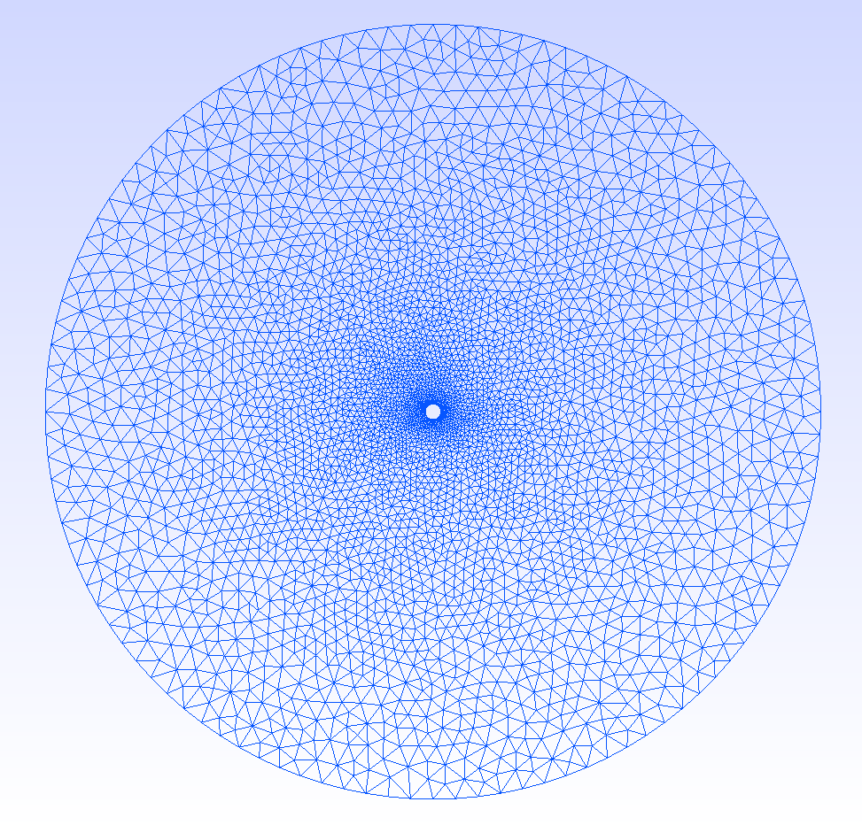
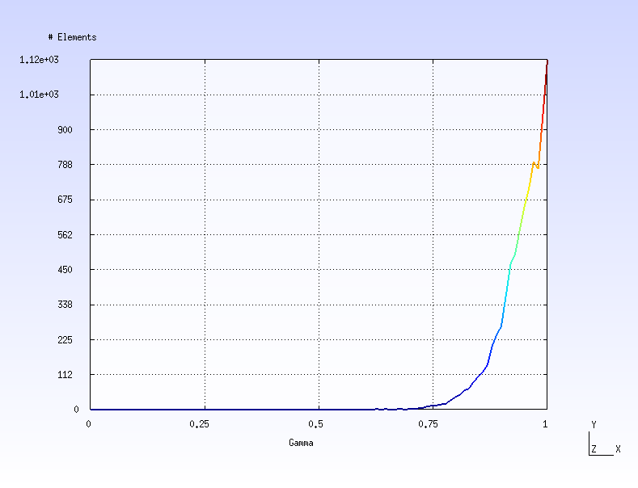
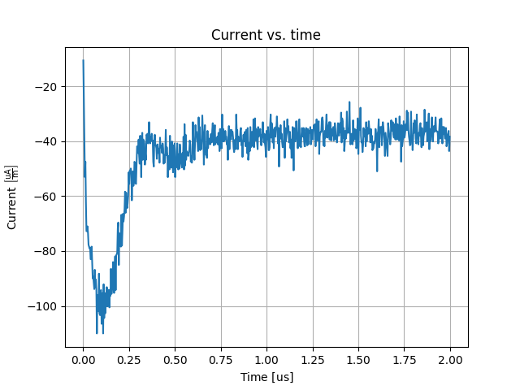
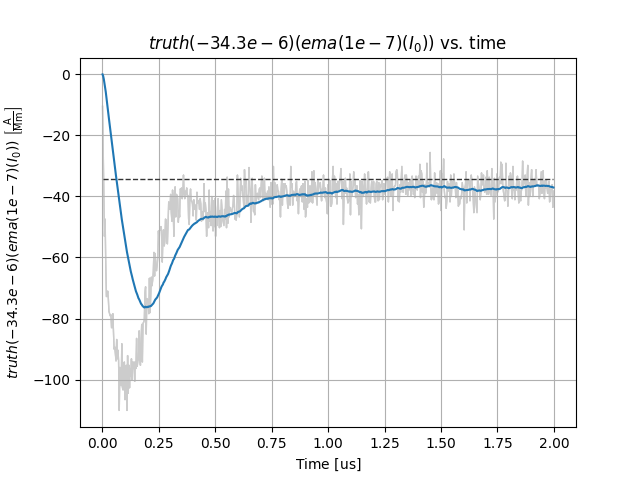

Tutorial: Getting Started
=========================

(Sigvald Marholm)

In this tutorial, we will carry out a 2D simulation of the current collected by a cylindrical Langmuir probe in non-drifting, non-magnetized, Maxwellian proton-electron plasma. The physical parameters of the problem is given below:

========================  ================================
Parameter                 Value
========================  ================================
Ion/electron density      :math:`10^{11}\,\mathrm{m^{-3}}`
Ion/electron temperature  :math:`3000\,\mathrm{K}`
Electron Debye length     approx. :math:`12\,\mathrm{mm}`
Probe radius              :math:`1\,\mathrm{mm}`
Probe voltage             :math:`3\,\mathrm{V}`
========================  ================================

We start by making a new directory for the project, and make a symbolic link to the ``interaction`` executable in this folder (modify paths as necessary)::

    cd ~
    mkdir -p Projects/tutorials/basic
    cd Projects/tutorials/basic
    ln -s ~/punc++/interaction/build/interaction

If using a system-wide installation of PUNC++, you can omit creating a symbolic link.

Mesh generation
---------------
Let's start by creating a mesh.
For a 2D simulation of a cylindrical probe the probe is represented by a circular, interior boundary.
We shall also use a circlular exterior boundary.
It is an assumption of the underlying numerical methods that the exterior boundary is in the background plasma and is not affected by any local perturbations in the electric potential.
This makes it necessary for the outer boundary to be outside the sheath of the probe.
The closer the outer boundary is to the probe, the less valid the assumption becomes, and the more it limits the accuracy of the simulation.
On the other hand, increasing the domain size increases the cost of the simulation.
The mesh gets bigger, and more simulation particles are needed to maintain the same density of particles in the domain.
It may in fact also be necessary to run the simulation for a longer physical time in order to reach a sufficiently steady state.
This is because the domain is uniformly filled with particles before the simulation starts, and rather violent, unphysical transients occur where the plasma is perturbed, e.g. where the sheath should be.
These transients may cause waves which takes a long time to settle.
In improving the accuracy of a simulation, one should attempt to improve the limiting factor, which may or may not be the radius of the outer boundary.
Finding the right set of simulation parameters requires some experimentation.
We will use an outer boundary of 100mm radius.

This geometry can be created either using the Gmsh *Graphical User Interface* (GUI), or it can be specified directly in a text file for Gmsh to read.
We shall call our geometry file ``cylinder.geo``:

.. literalinclude:: ../../../tutorials/basic/cylinder.geo

On the first four lines variables are defined for the inner and outer radii, as well as the resolution of the mesh on the inner and outer boundaries.
The resolution will vary continually between the boundaries.
The resolution must be sufficiently fine to resolve any characteristic lengths of the physics involved.
The outer boundary must therefore have a resolution not much bigger than the electron Debye length, whereas the inner boundary must in addition be sufficiently fine to resolve the circular cross-section of the probe.
Insufficiently resolving the electron Debye length is known to cause numerical heating of the plasma on rectangular meshes, and it is reasonable to expect simlar effects for unstructured meshes.
Since we are mostly interested in what happens close to the probe, we can often get away with a resolution that is actually somewhat bigger than the Debye length at the outer boundary.

The lines starting with ``Point`` defines a point in the center of the domain, as well as to the north, east, south and west of the center, on both boundaries. 
Each boundary is made up of four circle arcs (``Circle``) connected between these points.

It is important that the proper *Physical Groups* are created in Gmsh. PUNC++ needs one physical group for each boundary (``Physical Lines`` in 2D or ``Physical Surfaces`` in 3D).
Note that it is *mandatory* that the exterior boundary has the lowest id number of all boundaries since this is how PUNC++ knows which boundary is the exterior one.
It is also possible to define a physical group for the domain (``Physical Surface`` in 2D or ``Physical Volume`` in 3D), but this is optional.

Hint: For larger geometries it can be difficult to keep track of all line in a text editor. The author prefers to define the variables and the points in text, and subsequently opening it in Gmsh to connect arcs and lines between the points.

To generate the mesh from the geometry, run ``Mesh -> 2D`` from the GUI or from the terminal::

    $ gmsh -2 cylinder.geo 

For a 3D mesh it would be ``-3`` instead of ``-2``. The mesh is named ``cylinder.msh`` and should look something like this when opened in Gmsh:

The finite element approximation of the fields will be better the less sliver the cells in the mesh are. A gamma factor of 1 indicates a completely equilateral/regular cell, whereas a gamma of 0 indicates a degenerate cell. The quality of the mesh can be inspected from Gmsh by clicking ``Tools -> Statistics`` and then ``Update``. The average, minimum and maximum gamma factor should now be displayed, and it is possible to plot the distribution of the gamma values. It may look something like this:

Make sure most cells are above 0.3 and that the minimum value is not zero, i.e., that there are no degenerate cells.

Mesh files must be in either DOLFIN XML or HDF5 formats.
To convert the Gmsh mesh, use FEniCS's own conversion tool::

    $ dolfin-convert cylinder.msh cylinder.xml

You should now have the files ``cylinder.xml``, ``cylinder_facet_region.xml`` and possibly also ``cylinder_physical_region.xml``. The first file is the mesh itself, whereas the latter two contain the physical groups for the boundaries and the domain, respectively.

Running the simulation
----------------------
The ``interaction`` executable loads simulation settings from an ``ini`` file which we shall call ``setup.ini`` and put in the same folder as the mesh:

.. literalinclude:: ../../../tutorials/basic/setup.ini

Most settings in this file are pretty self-explanatory.
The mesh is found in ``cylinder.xml`` and the mesh is run for :math:`1\,\mathrm{\mu s}`.
Note that ``cylinder_facet_region.xml`` is also used although not explicitly mentioned.
The simulation consists of electrons and protons.
In particular, it contains :math:`5\cdot 10^5` macroparticles of each.
Notice also that some settings take suffixes (units).
Mass can for instance be specified in both electron masses (``me``) or atomic mass units (``amu``).

The exterior boundary should, as mentioned, have the lowest id in the ``.geo`` file.
The second lowest boundary id is taken to be object 0, the third lowest id object 1, and so forth.
The objects are always perfect electric conductors, and by default their floating potential will be self-consistently determined from collected charges.
In our case, however, we would like to fix the potential of the cylinder to 3V.
We do this by adding a voltage source (``vsource``) between system ground (``-1``) and the object (``0``) of 3V.
Multiple voltage and current sources can be defined between two objects, or between objects and sytem ground by adding several ``vsource`` and ``isource`` entries under the ``[objects]`` section.

For this simulation we have also included an optional diagnostics, namely that the electric potential be saved every 3 nanoseconds.

Finally, to run the simulation, type::

    $ ./interaction setup.ini

Omit ``./`` if using system-wide installation. After the simulation is complete, three ``dat`` files should appear. ``history.dat`` contains time-series diagnostics. ``population.dat`` contains all the particles at the end of the simulation and ``state.dat`` contains auxiliary variables necessary to continue the simulation from where it stopped. After having a look at the data, we would probably conclude that :math:`1\,\mathrm{\mu s}` was a bit short, and decide to increase it to :math:`2\,\mathrm{\mu s}`. We chould then simply change ``setup.ini`` and execute the program again to pick up the simulation where we left off. It is also possible to stop a simulation gracefully by pressing ``Ctrl+C`` once, and continuing the simulation later. Pressing ``Ctrl+C`` a second time kills the program instantly, without possibility for continuation. To restart a simulation from scratch, remove one of the ``dat`` files.

It is also possible to override a setting in an ``ini`` file by command line arguments. For instance, to expand the simulation time, we could also execute::

    $ ./interaction setup.ini --time.stop "2e-6 s"

``interaction`` supports a wide range of settings, each of which can be set either in the ``ini`` file or as a command line argument. The full list is available from::

    $ ./interaction --help

Inspecting the results
----------------------

Time-series are stored in a tabulated ASCII file ``history.dat``. The first few lines for our simulation is demonstrated below:

.. literalinclude:: history.dat

The first six columns shows the time-step, the physical time at the time-step, the number of negatively charged particles (electrons), the number of positively charged particles (ions), total kinetic energy of the particles, and total potential energy of the particles, respectively. Subsequently follows three columns for each objects, its voltage, collected current, and charge.

The commented lines in the header follows the syntax of Metaplot, which allows for easy visualization. To plot the current collected by the probe (which is object zero)::

    $ mpl history.dat "I[0]"

The current collected should according to OML theory be :math:`-35.3\,\mathrm{\mu A}`. Since the simulation is quite rough it is a bit hard to see how close it actually is. Let us perform an *Exponential Moving Average* (EMA) with a relaxation time of :math:`0.1\,\mathrm{\mu s}` and compare to the OML theory::

    $ mpl history.dat "truth(-34.3e-6)(ema(1e-7)(I[0]))"

This is not too bad given that the simulation is quite rough. Let us also plot the number of electrons and ions::

    $ mpl history.dat ne ni

.. image:: num_of_particles.png

The number of electrons seems to have reached steady-state. The number of ions have not had time to change very much. We not that Metaplot is a very experimental program at this stage. We do not delve further into it.

Finally, let us have a look at the electric potential we stored every :math:`3\,\mathrm{ns}`. The field quantities are stored in the ``fields`` folder in VTK format, and is easily visualized using ParaView. To open the electric potential::

    $ paraview fields/phi.pvd

Inside ParaView, click ``Apply`` and then the green play symbol to start an animation. It should look something like the following:

.. image:: phi.gif

Initially the plasma is uniformly distributed and the potential is that of a cylinder in vacuum. As the sheath starts forming due to the surrounding plasma, acoustic shock waves emerges and travel outwards, eventually forming standing waves between the boundaries before they die out and the correct solution is arrived at at steady-state.
